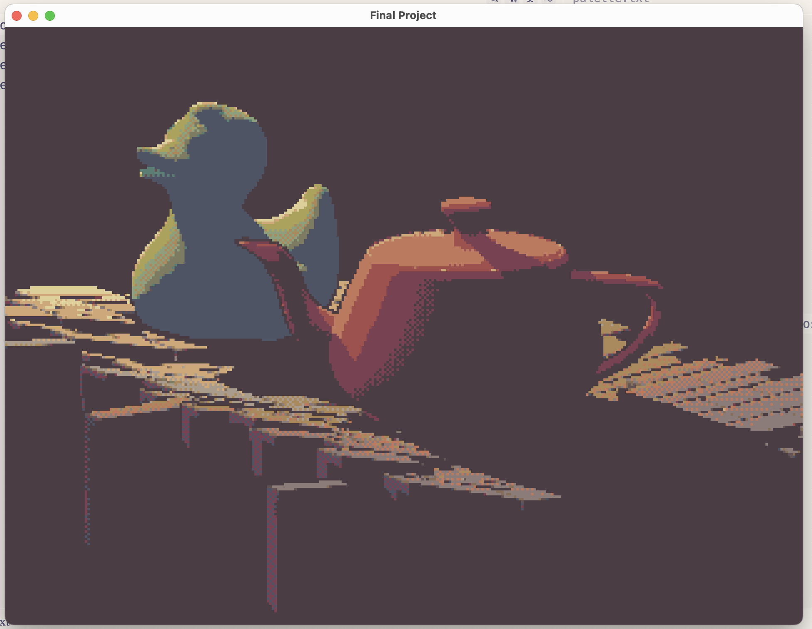
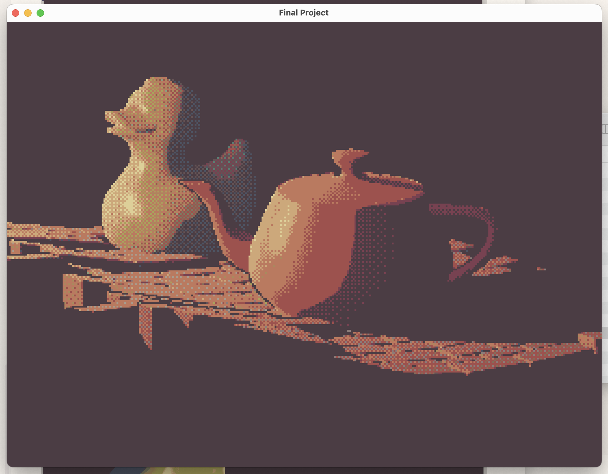
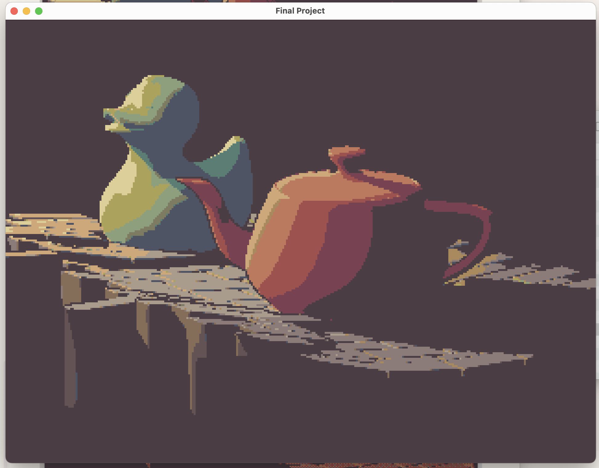
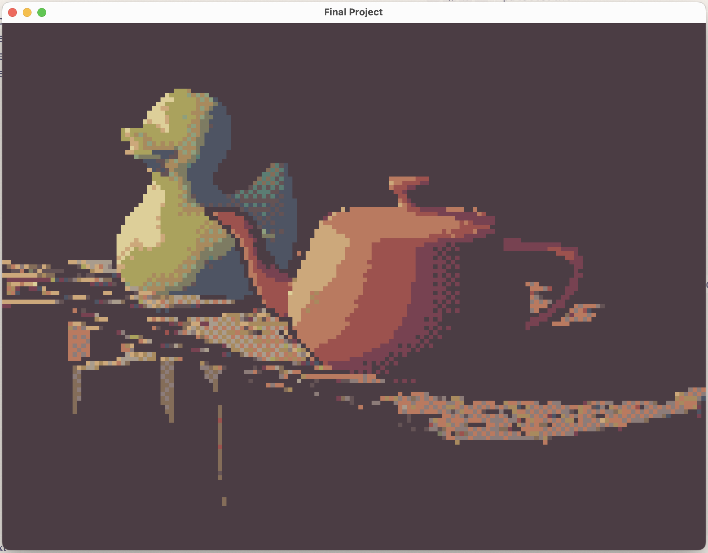
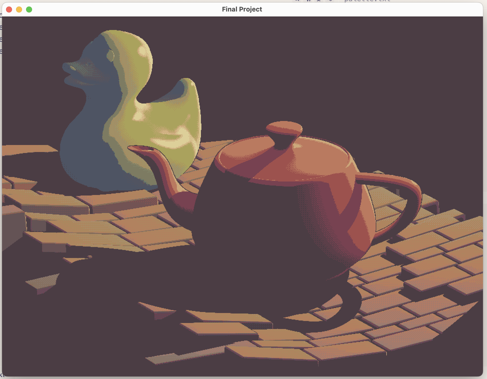
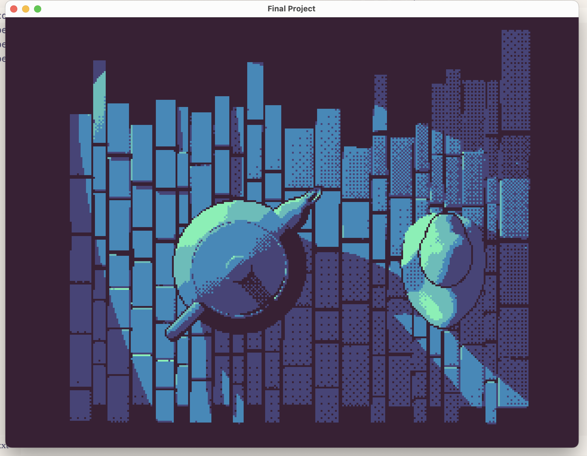
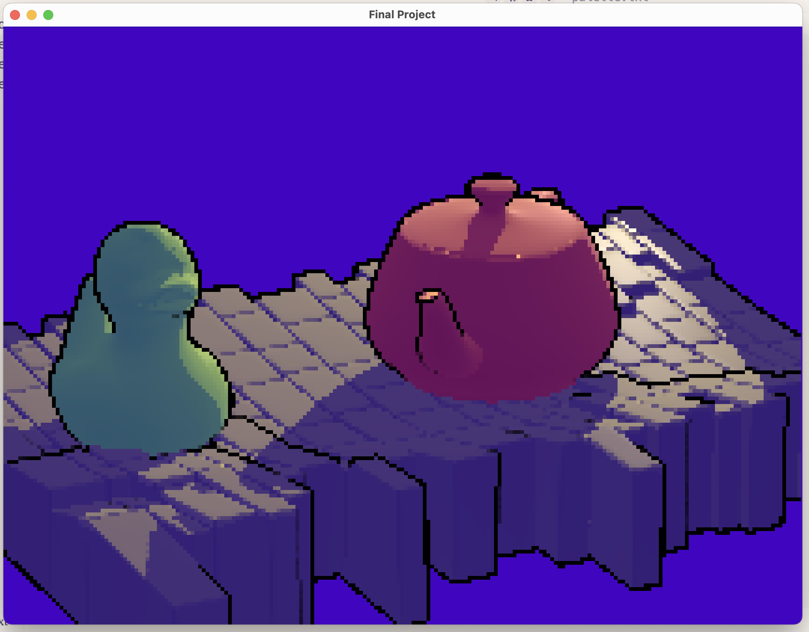

Made as a final project for [Cem Yuksel's Interactive Computer Graphics](https://www.youtube.com/playlist?list=PLplnkTzzqsZS3R5DjmCQsqupu43oS9CFN) course.
# How to Use

_Tested on a MacBook Pro 2023 (Apple M2 Pro)_. You may need to update include paths in the Makefile to make the project work for your system.

Ensure you have [GLFW](https://www.glfw.org/) installed.

Build and run the program like so:

```bash
> make app
> ./App.exe palette.txt
```

Where `palette.txt` is a text file containing newline-delimited hex strings where each line is a color in your palette. For example:

```txt
#ddcf99
#cca87b
#b97a60
#9c524e
#774251
#4b3d44
#4e5463
#5b7d73
#8e9f7d
#645355
#8c7c79
#a99c8d
#7d7b62
#aaa25d
#846d59
#a88a5e
```

[Lospec](https://lospec.com/) is a great resource for finding color palettes.

## Controls

- **`I`** : Zoom in
- **`O`** : Zoom out
- **`-`** : Decrease render resolution (increases pixelation effect)
- **`+`** : Increase render resolution (decreases pixelation effect)
- **`T`**: Toggle color palette matching
- **`<`** : Decrease dithering intensity
- **`>`** : Increase dithering intensity
- **`ESC`**: Close the program

# Summary of the Render Pipeline

There are two main mechanisms used to create this faux pixel art renderer. They are:

1. Gooch shading as described in [Amy Gooch's paper](https://www.researchgate.net/profile/Amy-Gooch-2/publication/2356479_Interactive_Non-Photorealistic_Technical_Illustration/links/0deec51b60869d3171000000/Interactive-Non-Photorealistic-Technical-Illustration.pdf), with some additions:
   - Shadow mapping for better depth/lighting clarity;
   - A Fresnel effect to increase reflectivity when viewing the surface from grazing angles; and
   - More natural warm/cool tone interpolation via the Oklab color space.
2. A three-stage rendering pipeline for rendering in a pixel art aesthetic:
   - **\*First stage:** Lighting, shading, and depth information (rendered at a low resolution).
   - **Second Stage:** A pixel art post-processing layer.
     - Depth-based edge detection to draw 1 pixel edges wherever a dramatic change in depth is detected. Didn't consult a paper or anything, just wrote it from scratch.
     - Color palette matching featuring ordered dithering using a $4\times4$ Bayer Matrix. A pretty direct implementation of an algorithm I designed in 2023.
   - **Third Stage:** Upscaling to the full viewport size.

**Other Notes:**

- You'll notice the teapot is red and the duck is green. Model colors are derived from the `Kd` properties in the provided `.mtl` files. Other properties like `Ks` (specular color) and `Ns` (shininess) and `map_Kd` are also incorporated into the shader. I've chosen to not use color and specular maps as a stylistic choice, but they are supported.
- The Warm and Cool tones used for Gooch shading are hard-coded into the `mesh.frag` shader. These and other settings can be changed to match the stylistic preferences of the user.

```glsl
const vec3 K_COOL = vec3(64.0, 6.0, 191.0) / 255.0;
const vec3 K_WARM = vec3(255.0, 223.0, 97.0) / 255.0;
const float ALPHA = 0.6;
const float BETA = 0.2;
const float FRESNEL_SCALE = 0.3;
```

# Screenshots

Default Settings



High Dithering Strength


Low Dithering Strength (zero)


Low Render Resolution (High Pixelation Effect)


High Render Resolution (Low Pixelation Effect)


Another Color Palette and Camera Angle


Palette Matching Disabled

